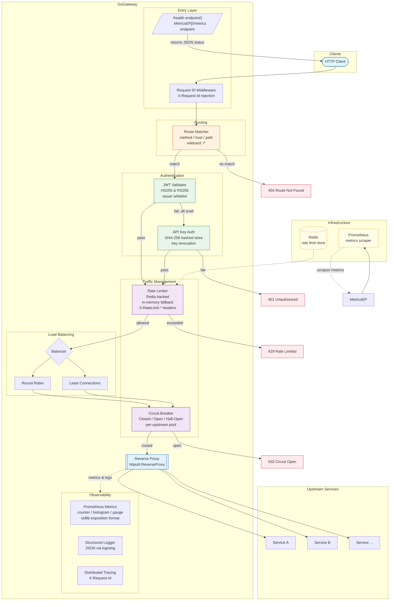
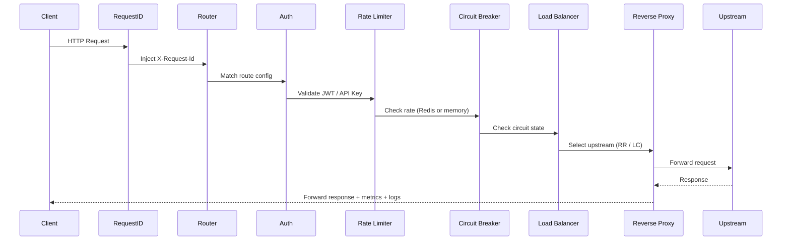
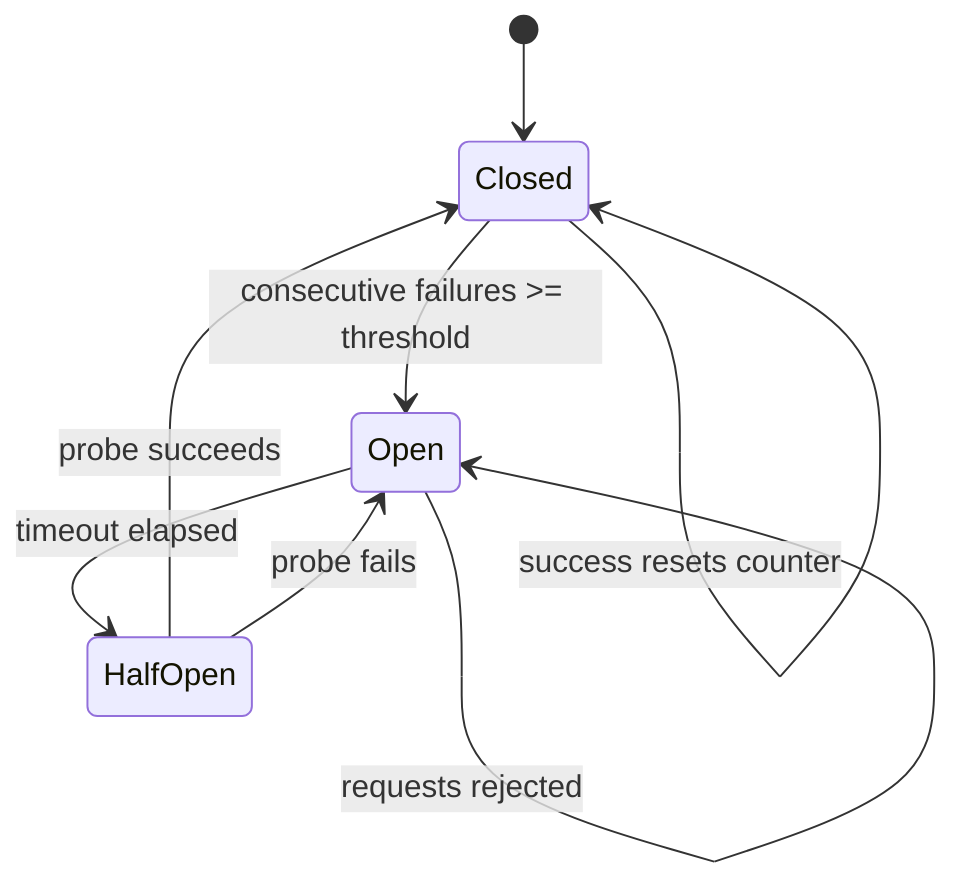

# GoGateway

> A lightweight, high-performance API gateway and reverse proxy — built from scratch in Go.

[](https://go.dev)
[](#license)

---

## What This Is

**GoGateway** is a production-grade API gateway that sits between clients and backend services, handling routing, authentication, rate limiting, load balancing, circuit breaking, and observability — all implemented from scratch with zero framework dependencies.

It is not a wrapper around Kong, Traefik, or Envoy. Every component — the reverse proxy, route matcher, load balancers, authentication middleware, circuit breaker, rate limiter, and Prometheus metrics exporter — was designed and implemented using only the Go standard library with three well-chosen external packages ([golang-jwt](https://github.com/golang-jwt/jwt), [go-redis](https://github.com/redis/go-redis), [yaml.v3](https://gopkg.in/yaml.v3)).

Designed as a portfolio project, it demonstrates deep understanding of distributed systems patterns, Go systems programming, cloud-native deployment, and production software engineering practices.

---

## What Problem It Solves

Modern microservice architectures need a unified entry point to handle cross-cutting concerns. GoGateway provides that layer — accepting incoming HTTP traffic and intelligently routing it to upstream services while enforcing security policies, managing traffic, and maintaining observability — through a simple YAML configuration file.

---

## Quick Start

```bash
# Clone and start with docker-compose (Redis + Prometheus included)
git clone https://github.com/ahmadkhidir/gogateway.git
cd gogateway
docker compose up -d

# Verify it's running
curl http://localhost:8080/health
# → {"status":"ok","timestamp":"2026-06-14T12:00:00Z"}

# Prometheus metrics
curl http://localhost:9090/metrics

# The gateway proxies to upstreams defined in gogateway.yaml
curl http://localhost:8080/anything
```

Or build and run standalone:

```bash
go build -o gogateway ./cmd/gogateway
./gogateway --config-path gogateway.yaml
```

---

## Architecture Overview



### Request Flow



### State Machine: Circuit Breaker



---

## Features

### Core Proxy & Routing
- **Dynamic reverse proxy** — forwards requests to configurable upstream backends, rewriting paths and preserving query strings
- **Multi-dimension route matching** — matches on HTTP method, Host header, and URL path with wildcard support (`/api/*`)
- **Load balancing** — pluggable `Balancer` interface with round-robin and least-connections strategies

### Authentication & Security
- **JWT validation** — supports HS256 (HMAC) and RS256 (RSA) with issuer whitelist verification; forwards decoded claims to upstreams via `X-User-ID` and `X-User-Claims` headers
- **API key authentication** — keys stored as SHA-256 hashes with metadata (tier, service scope); supports key revocation
- **Fallback auth chain** — routes can require JWT, API key, or both (try JWT first, fall back to API key)

### Traffic Management
- **Rate limiting** — Redis-backed (Lua script for atomic operations) with automatic in-memory fallback; configurable per-route and per-client; sets standard rate limit headers (`X-RateLimit-Limit`, `X-RateLimit-Remaining`, `X-RateLimit-Reset`, `Retry-After`)
- **Circuit breaker** — three-state pattern (Closed → Open → Half-Open) configurable per-route; protects upstreams from cascading failures

### Observability
- **Custom Prometheus metrics** — implemented without Prometheus client library; pure standard library exposition format:
  - `gogateway_requests_total` (counter, labeled by route/method/status)
  - `gogateway_request_duration_seconds` (histogram, labeled by route/method)
  - `gogateway_active_connections` (gauge)
  - `gogateway_circuit_breaker_state` (gauge, labeled by route/upstream)
  - `gogateway_rate_limit_rejections_total` (counter, labeled by route)
- **Structured logging** — JSON output via Go 1.21+ `log/slog`; configurable levels (debug/info/warn/error)
- **Request tracing** — auto-generated or forwarded `X-Request-Id` headers for distributed tracing

### Operations
- **Graceful shutdown** — configurable timeout; drains in-flight requests before stopping
- **Health endpoint** — `/health` returns JSON status for Kubernetes liveness/readiness probes
- **Multi-stage Docker build** — 5.4MB minimal runtime image (Alpine + CA certs)
- **Kubernetes manifests** — Deployment (horizontal scaling), Service (ClusterIP), ConfigMap, Redis
- **docker-compose** — one-command local dev environment with Redis and Prometheus

---

## Code Organization

```
.
├── cmd/gogateway/
│   └── main.go              # Entry point, signal handling, graceful shutdown
├── internal/
│   ├── config/              # YAML-based configuration model with validation
│   ├── server/              # HTTP server, request lifecycle, reverse proxy
│   ├── router/              # Route matching engine (method/host/path)
│   ├── balancer/            # Load balancing strategies (interface + impls)
│   │   ├── balancer.go      # Balancer interface
│   │   ├── roundrobin.go    # Round-robin strategy
│   │   └── leastconn.go     # Least-connections strategy
│   ├── middleware/           # HTTP middleware chain
│   │   ├── jwt.go           # JWT authentication (HS256/RS256)
│   │   ├── apikey.go        # API key authentication
│   │   ├── ratelimit.go     # Rate limiter (Redis + in-memory fallback)
│   │   ├── circuitbreaker.go# Circuit breaker (Closed/Open/Half-Open)
│   │   └── requestid.go     # Request ID injection/preservation
│   ├── discovery/           # Service registry (static, extensible)
│   ├── metrics/             # Custom Prometheus metrics (zero deps)
│   ├── store/               # Data stores (API key store, Redis client)
│   └── logger/              # Structured JSON logger initialization
├── deploy/
│   ├── prometheus.yml        # Prometheus scraping configuration
│   ├── k8s-deployment.yaml   # Kubernetes Deployment
│   ├── k8s-service.yaml      # Kubernetes Service
│   ├── k8s-configmap.yaml    # Kubernetes ConfigMap
│   └── k8s-redis.yaml        # Kubernetes Redis
├── docs/GoGateway/           # Product documentation
├── Dockerfile                # Multi-stage Docker build
├── docker-compose.yml       # Local dev environment
└── gogateway.yaml           # Default gateway configuration
```

---

## Project Philosophy & Design Decisions

### 1. Standard Library First
The Go standard library is remarkably capable. The `net/http/httputil.ReverseProxy` handles connection pooling, buffering, and error recovery. The `log/slog` package provides production-grade structured logging. HTTP itself is the protocol — no gRPC, no service mesh sidecar, no framework lock-in. External packages are used only where the standard library has gaps: JWT parsing, Redis protocol, and YAML parsing.

### 2. Fail Gracefully, Degrade Predictably
Every external dependency has a fallback. If Redis is unavailable for rate limiting, the gateway falls back to in-memory counters with periodic cleanup — it never crashes, never blocks startup, and never becomes a single point of failure.

### 3. Observability by Design
Metrics, logs, and tracing are not afterthoughts. Every request generates a structured log line, updates Prometheus histograms, increments counters, and receives a traceable request ID — all without external aggregation services at runtime.

### 4. Concurrency Safety as Default
All shared state (breakers, rate limit counters, balancer indices, key stores) is protected by `sync.Mutex` or `sync.RWMutex`. The code is designed for goroutine safety from the ground up.

### 5. Config-Driven, Not Code-Driven
Routing rules, authentication requirements, rate limits, and circuit breaker settings are declared in YAML — no code changes needed to add a new upstream or adjust traffic policies.

---

## Configuration

Routes are defined in a YAML file. Here is a minimal example:

```yaml
gateway:
  listen: ":8080"
  shutdown_timeout: 15s
  log_level: "info"

redis:
  addr: "localhost:6379"
  db: 0
  pool_size: 20

routes:
  - id: "users-api"
    path: "/api/users/*"
    methods: ["GET", "POST"]
    upstreams:
      - url: "http://users-service:3000"
      - url: "http://users-service-secondary:3000"
    auth:
      jwt:
        required: true
        issuers: ["https://auth.example.com"]
    rate_limit:
      enabled: true
      requests: 100
      window: 1m
      per_client: true
    circuit_breaker:
      enabled: true
      threshold: 5
      timeout: 30s
      half_open_max_requests: 3
```

---

## Testing

Tests cover all packages with a focus on correctness of concurrent behaviour:

```bash
# Run all tests
go test ./...

# With race detector (essential for concurrent code)
go test -race ./...

# With coverage
go test -coverprofile=profile.out ./...
go tool cover -html=profile.out
```

---

## Deployment

### Docker

```bash
docker compose up -d
```

This starts the gateway (`:8080`), Redis (`:6379`), and Prometheus (`:9091`).

### Kubernetes

```bash
kubectl apply -f deploy/k8s-configmap.yaml
kubectl apply -f deploy/k8s-redis.yaml
kubectl apply -f deploy/k8s-deployment.yaml
kubectl apply -f deploy/k8s-service.yaml
```

The deployment supports horizontal scaling (2 replicas by default) with a `ClusterIP` service exposing ports 80 (HTTP) and 9090 (metrics).

---

## What This Project Demonstrates

For hiring managers and fellow engineers reviewing this code, here is what the project is designed to showcase:

| Area | Evidence |
|---|---|
| **Go systems programming** | HTTP server, reverse proxy, signal handling, graceful shutdown, `sync` primitives |
| **Distributed systems patterns** | Circuit breaker, rate limiting, load balancing, service discovery |
| **Production operations** | Structured JSON logging, Prometheus metrics, health checks, Docker, K8s manifests |
| **Security engineering** | Token validation (HMAC + RSA), secure key hashing, configurable auth chains |
| **Clean architecture** | Package-separated responsibilities, interface-driven design, testable abstractions |
| **Concurrent programming** | Goroutine-safe shared state, `sync.RWMutex` patterns, background goroutines |
| **Resilience engineering** | Graceful degradation (Redis fallback), circuit breaking, configurable timeouts |
| **DevOps readiness** | Multi-stage Docker build, docker-compose, Kubernetes manifests, Prometheus integration |
| **Test-driven development** | Unit tests with race detection, table-driven tests, interface-based testability |

---

## External Dependencies

The project deliberately minimizes external dependencies:

| Package | Purpose | Why Not Standard Library |
|---|---|---|
| `golang-jwt/jwt/v5` | JWT parsing and validation | Go stdlib has no JWT support |
| `go-redis/v9` | Redis client for rate limiting | Go stdlib has no Redis protocol support |
| `yaml.v3` | YAML configuration parsing | Go stdlib includes `encoding/json` but not YAML |

**Zero web frameworks.** Zero Prometheus client libraries. Zero HTTP router libraries. Zero dependency injection frameworks.

---

## About The Author

Built by [Ahmad Khidir](https://github.com/ahmadkhidir) as a portfolio project demonstrating production-grade distributed systems engineering in Go. It represents real engineering judgment — decisions about what to build from scratch, when to use a library, how to handle failure, and how to design for operations.

---

## License

MIT
