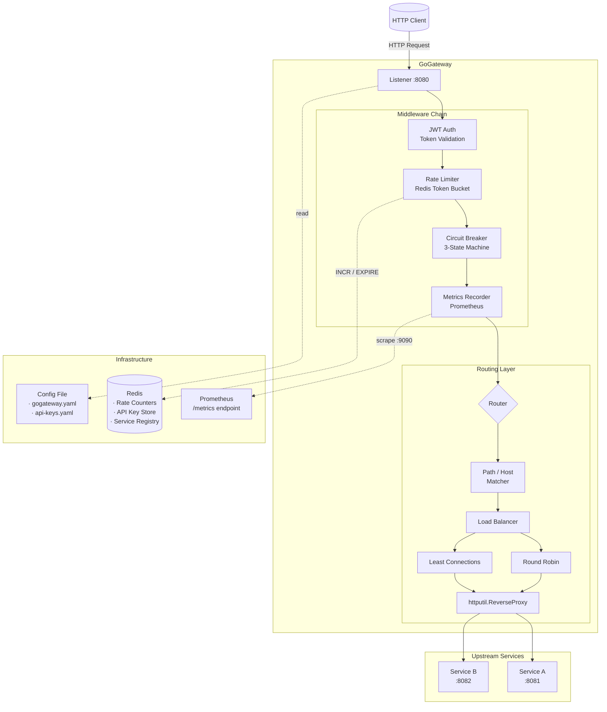
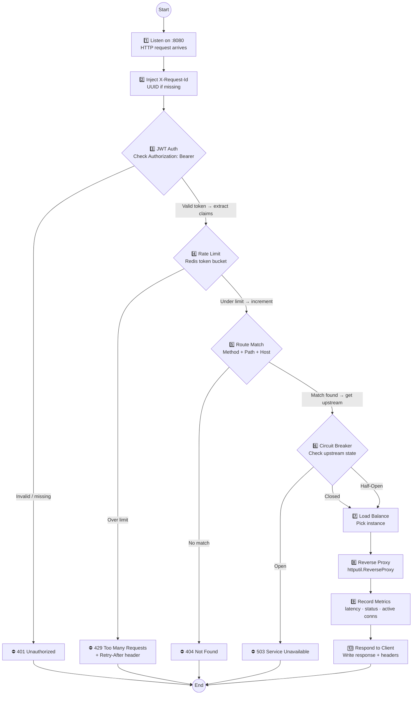

# Architecture — GoGateway

## High-Level Component Diagram



---

## Request Lifecycle



---

## Internal Package Structure

```
cmd/
└── gogateway/
    └── main.go              # Entry point, signal handling, server start

internal/
├── config/
│   ├── config.go            # Config struct + YAML/JSON loader
│   └── config_test.go
├── server/
│   ├── server.go            # HTTP server setup, graceful shutdown
│   └── server_test.go
├── middleware/
│   ├── jwt.go               # JWT validation middleware
│   ├── jwt_test.go
│   ├── apikey.go            # API key authentication middleware
│   ├── ratelimit.go         # Rate limiting middleware
│   ├── ratelimit_test.go
│   ├── circuitbreaker.go    # Circuit breaker middleware
│   ├── circuitbreaker_test.go
│   ├── requestid.go         # X-Request-Id injection
│   └── metrics.go           # Prometheus metrics recording
├── router/
│   ├── router.go            # Route matching (path + host)
│   ├── router_test.go
│   └── route.go             # Route struct definition
├── balancer/
│   ├── balancer.go          # Load balancer interface
│   ├── roundrobin.go        # Round-robin implementation
│   ├── leastconn.go         # Least-connections implementation
│   └── balancer_test.go
├── discovery/
│   ├── static.go            # Static service registry from config
│   ├── redis.go             # Redis-backed dynamic registry
│   └── discovery_test.go
├── store/
│   ├── redis.go             # Redis client wrapper (rate limit + API keys)
│   └── store_test.go
└── metrics/
    ├── prometheus.go        # Prometheus metric definitions
    └── metrics_test.go
```

---

## Key Design Decisions

| Decision | Rationale |
|---|---|
| **Middleware as `http.Handler` wrappers** | Idiomatic Go, composable, testable with `httptest` |
| **Config file (YAML) over CLI flags** | Complex nested structures are easier to read/write in YAML; flags for overrides (e.g., `--config-path`) |
| **Redis for rate limiting** | Atomic counters (INCR/EXPIRE), shared state across gateway instances, no external rate limit library needed |
| **Round-robin + least-connections** | Two strategies cover "simple" and "production" needs; interface makes adding more trivial |
| **Prometheus client library** | Industry standard, `promhttp.HandlerFor` exposes metrics on a separate port or path |
| **No framework** | Portfolio demonstration of `net/http` mastery; no `gin`, `chi`, `mux` — plain `http.ServeMux` + `http.Handler` |
| **Graceful shutdown** | `http.Server.Shutdown()` with configurable timeout; ensures in-flight requests complete |
